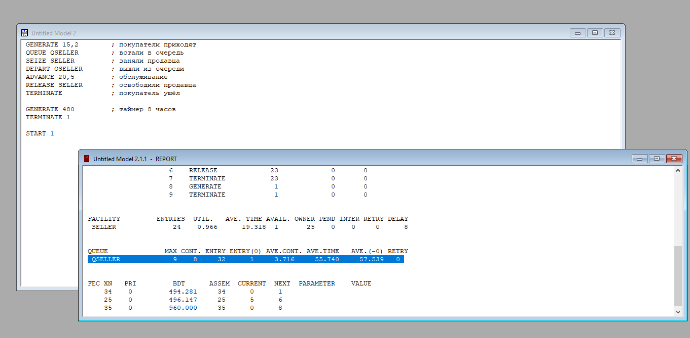

# 1
```
GENERATE 15,2        ; покупатели приходят
QUEUE QSELLER        ; встали в очередь
SEIZE SELLER         ; заняли продавца
DEPART QSELLER       ; вышли из очереди
ADVANCE 20,5         ; обслуживание
RELEASE SELLER       ; освободили продавца
TERMINATE            ; покупатель ушёл

GENERATE 480         ; таймер 8 часов
TERMINATE 1

START 1
```



# 2
```
GENERATE 12,5        ; покупатели приходят
QUEUE              MAX CONT. ENTRY ENTRY(0) AVE.CONT. AVE.TIME   AVE.(-0) RETRY
 QSELLER            18   18     41      1     8.769    102.662    105.229   0
```

```
GENERATE 8, 4        ; покупатели приходят
QUEUE              MAX CONT. ENTRY ENTRY(0) AVE.CONT. AVE.TIME   AVE.(-0) RETRY
 QSELLER            37   36     60      1    18.132    145.058    147.517   0
```

# 3
```
GENERATE 15,2        ; покупатели приходят
QUEUE QSELLER        ; встали в очередь
SEIZE SELLER         ; заняли продавца
DEPART QSELLER       ; вышли из очереди
ADVANCE 20,5         ; обслуживание
RELEASE SELLER       ; освободили продавца
TERMINATE 1            ; покупатель ушёл


START 100

QUEUE              MAX CONT. ENTRY ENTRY(0) AVE.CONT. AVE.TIME   AVE.(-0) RETRY
 QSELLER            38   38    138      1    18.599    278.484    280.517   0
```

# 4
средняя величина очереди 1.659 при 15+-13.
При Advance X максимальный X 15, после 16 идет увеличение до 3
```
GENERATE 15,2        ; покупатели приходят
QUEUE QSELLER        ; встали в очередь
SEIZE SELLER         ; заняли продавца
DEPART QSELLER       ; вышли из очереди
ADVANCE 15,13         ; обслуживание
RELEASE SELLER       ; освободили продавца
TERMINATE 1            ; покупатель ушёл


START 100

QUEUE              MAX CONT. ENTRY ENTRY(0) AVE.CONT. AVE.TIME   AVE.(-0) RETRY
 QSELLER             6    5    105     11     1.659     25.173     28.118   0

```

# 5
```
GENERATE  15,2                ;Новый посетитель
QUEUE     QSELLER             ;Постановка в очередь
SEIZE     SELLER              ;Начать обслуживание или          ожидать в очереди, когда продавец освободится
DEPART    QSELLER             ;Выход из очереди
ADVANCE   10,5                ;Обслуживание покупателя
RELEASE   SELLER              ;Завершение обслуживания
QUEUE     QKASSA              ;Постановка в очередь
SEIZE     KASSA               ;Начать обслуживание или          ожидать в очереди, когда кассир освободится
DEPART    QKASSA              ;Выход из очереди
ADVANCE   5,2                ;Обслуживание покупателя
RELEASE   KASSA              ;Завершение обслуживания
TERMINATE
                                  
GENERATE  480
TERMINATE 1

START 1

FACILITY         ENTRIES  UTIL.   AVE. TIME AVAIL. OWNER PEND INTER RETRY DELAY
 SELLER              31    0.630       9.761  1        0    0    0     0      0
 KASSA               31    0.318       4.918  1       32    0    0     0      0


QUEUE              MAX CONT. ENTRY ENTRY(0) AVE.CONT. AVE.TIME   AVE.(-0) RETRY
 QSELLER             1    0     31     28     0.008      0.125      1.292   0   <<---
 QKASSA              1    0     31     31     0.000      0.000      0.000   0   <<---


FEC XN   PRI         BDT      ASSEM  CURRENT  NEXT  PARAMETER    VALUE
    33    0         484.100     33      0      1
    32    0         484.639     32     10     11
    34    0         960.000     34      0     13

```

# 6
```
GENERATE  30,10                ;Новый посетитель
QUEUE     QSELLER             ;Постановка в очередь
SEIZE     SELLER              ;Начать обслуживание или          ожидать в очереди, когда продавец освободится
DEPART    QSELLER             ;Выход из очереди
ADVANCE   12,2                ;Обслуживание покупателя
RELEASE   SELLER              ;Завершение обслуживания
QUEUE     QKASSA              ;Постановка в очередь
SEIZE     KASSA               ;Начать обслуживание или          ожидать в очереди, когда кассир освободится
DEPART    QKASSA              ;Выход из очереди
ADVANCE   7,2                ;Обслуживание покупателя
RELEASE   KASSA              ;Завершение обслуживания
TERMINATE

GENERATE  7,2,360                ;Новый посетитель
QUEUE     QSELLER             ;Постановка в очередь
SEIZE     SELLER              ;Начать обслуживание или          ожидать в очереди, когда продавец освободится
DEPART    QSELLER             ;Выход из очереди
ADVANCE   12,2                ;Обслуживание покупателя
RELEASE   SELLER              ;Завершение обслуживания
QUEUE     QKASSA              ;Постановка в очередь
SEIZE     KASSA               ;Начать обслуживание или          ожидать в очереди, когда кассир освободится
DEPART    QKASSA              ;Выход из очереди
ADVANCE   7,2                ;Обслуживание покупателя
RELEASE   KASSA              ;Завершение обслуживания
TERMINATE
                            
                                
GENERATE  480
TERMINATE 1
START 1

FACILITY         ENTRIES  UTIL.   AVE. TIME AVAIL. OWNER PEND INTER RETRY DELAY
 SELLER              22    0.527      11.495  1       21    0    0     0     12
 KASSA               21    0.310       7.091  1       23    0    0     0      0


QUEUE              MAX CONT. ENTRY ENTRY(0) AVE.CONT. AVE.TIME   AVE.(-0) RETRY
 QSELLER            12   12     34     12     1.527     21.563     33.325   0
 QKASSA              1    0     21     21     0.000      0.000      0.000   0


FEC XN   PRI         BDT      ASSEM  CURRENT  NEXT  PARAMETER    VALUE
    32    0         482.228     32      0      1
    23    0         482.988     23     22     23
    37    0         485.027     37      0     13
    21    0         486.126     21      5      6
    38    0         960.000     38      0     25
```

---

```
GENERATE  30,10                ;Новый посетитель
QUEUE     QSELLER             ;Постановка в очередь
SEIZE     SELLER              ;Начать обслуживание или          ожидать в очереди, когда продавец освободится
DEPART    QSELLER             ;Выход из очереди
ADVANCE   5                ;Обслуживание покупателя
RELEASE   SELLER              ;Завершение обслуживания
QUEUE     QKASSA              ;Постановка в очередь
SEIZE     KASSA               ;Начать обслуживание или          ожидать в очереди, когда кассир освободится
DEPART    QKASSA              ;Выход из очереди
ADVANCE   6                ;Обслуживание покупателя
RELEASE   KASSA              ;Завершение обслуживания
TERMINATE

GENERATE  7,2,360                ;Новый посетитель
QUEUE     QSELLER             ;Постановка в очередь
SEIZE     SELLER              ;Начать обслуживание или          ожидать в очереди, когда продавец освободится
DEPART    QSELLER             ;Выход из очереди
ADVANCE   5                ;Обслуживание покупателя
RELEASE   SELLER              ;Завершение обслуживания
QUEUE     QKASSA              ;Постановка в очередь
SEIZE     KASSA               ;Начать обслуживание или          ожидать в очереди, когда кассир освободится
DEPART    QKASSA              ;Выход из очереди
ADVANCE   6                ;Обслуживание покупателя
RELEASE   KASSA              ;Завершение обслуживания
TERMINATE
                            
                                
GENERATE  480
TERMINATE 1
START 1      


FACILITY         ENTRIES  UTIL.   AVE. TIME AVAIL. OWNER PEND INTER RETRY DELAY
 SELLER              32    0.332       4.978  1       31    0    0     0      1
 KASSA               30    0.373       5.965  1       32    0    0     0      1


QUEUE              MAX CONT. ENTRY ENTRY(0) AVE.CONT. AVE.TIME   AVE.(-0) RETRY
 QSELLER             1    1     33     22     0.061      0.882      2.646   0
 QKASSA              2    1     31     14     0.113      1.757      3.203   0
```

очередь 1 и 2 достигается при seller speed, casher speed 5 и 6

# 7
```
GENERATE  30,10                ;Новый посетитель
    TRANSFER 300,,SkipAtDay
    QUEUE     QSELLER             ;Постановка в очередь
    SEIZE     SELLER              ;Начать обслуживание или          ожидать в очереди, когда продавец освободится
    DEPART    QSELLER             ;Выход из очереди


    ADVANCE   5                ;Обслуживание покупателя
    RELEASE   SELLER              ;Завершение обслуживания
    QUEUE     QKASSA              ;Постановка в очередь
    SEIZE     KASSA               ;Начать обслуживание или          ожидать в очереди, когда кассир освободится
    DEPART    QKASSA              ;Выход из очереди
    ADVANCE   5                ;Обслуживание покупателя
    RELEASE   KASSA              ;Завершение обслуживания
SkipAtDay TERMINATE

GENERATE  7,2,360                ;Новый посетитель
    TRANSFER 400,,SkipAtNight
    QUEUE     QSELLER             ;Постановка в очередь
    SEIZE     SELLER              ;Начать обслуживание или          ожидать в очереди, когда продавец освободится
    DEPART    QSELLER             ;Выход из очереди


    ADVANCE   5                ;Обслуживание покупателя
    RELEASE   SELLER              ;Завершение обслуживания
    QUEUE     QKASSA              ;Постановка в очередь
    SEIZE     KASSA               ;Начать обслуживание или          ожидать в очереди, когда кассир освободится
    DEPART    QKASSA              ;Выход из очереди
    ADVANCE   5                ;Обслуживание покупателя
    RELEASE   KASSA              ;Завершение обслуживания
SkipAtNight TERMINATE
                                
                                    
GENERATE  480
TERMINATE 1
START 1      


 LABEL              LOC  BLOCK TYPE     ENTRY COUNT CURRENT COUNT RETRY
                    1    GENERATE            16             0       0
                    2    TRANSFER            16             0       0
                    3    QUEUE               11             0       0
                    4    SEIZE               11             0       0
                    5    DEPART              11             0       0
                    6    ADVANCE             11             0       0
                    7    RELEASE             11             0       0
                    8    QUEUE               11             0       0
                    9    SEIZE               11             0       0
                   10    DEPART              11             0       0
                   11    ADVANCE             11             0       0
                   12    RELEASE             11             0       0
SKIPATDAY          13    TERMINATE           16             0       0
                   14    GENERATE            18             0       0
                   15    TRANSFER            18             0       0
                   16    QUEUE               13             0       0
                   17    SEIZE               13             0       0
                   18    DEPART              13             0       0
                   19    ADVANCE             13             1       0
                   20    RELEASE             12             0       0
                   21    QUEUE               12             0       0
                   22    SEIZE               12             0       0
                   23    DEPART              12             0       0
                   24    ADVANCE             12             1       0
                   25    RELEASE             11             0       0
SKIPATNIGHT        26    TERMINATE           16             0       0
                   27    GENERATE             1             0       0
                   28    TERMINATE            1             0       0


FACILITY         ENTRIES  UTIL.   AVE. TIME AVAIL. OWNER PEND INTER RETRY DELAY
 SELLER              24    0.242       4.838  1       36    0    0     0      0
 KASSA               23    0.233       4.873  1       34    0    0     0      0


QUEUE              MAX CONT. ENTRY ENTRY(0) AVE.CONT. AVE.TIME   AVE.(-0) RETRY
 QSELLER             1    0     24     22     0.013      0.264      3.168   0
 QKASSA              1    0     23     23     0.000      0.000      0.000   0


FEC XN   PRI         BDT      ASSEM  CURRENT  NEXT  PARAMETER    VALUE
    34    0         482.926     34     24     25
    36    0         483.899     36     19     20
    37    0         487.182     37      0     14
    35    0         504.869     35      0      1
    38    0         960.000     38      0     27

```

5 5

# 8
## 8.1
Определить, какова средняя и максимальная длины очередей в магазине, если моделирование выполняется в течение 8 часов. Определить среднее время пребывания клиента в очереди к кассиру и каждому из продавцов.
```
GENERATE  30,10                ;Новый посетитель
    TRANSFER 300,,SkipAtDay
    QUEUE     QSELLER             ;Постановка в очередь
    TRANSFER 500,SELLER1DAY,SELLER2DAY

SELLER1DAY SEIZE     SELLER              ;Начать обслуживание или          ожидать в очереди, когда продавец освободится
    DEPART    QSELLER             ;Выход из очереди
    ADVANCE   5                ;Обслуживание покупателя
    RELEASE   SELLER              ;Завершение обслуживания
    TRANSFER ,GOTOKASSADAY

SELLER2DAY SEIZE SELLER2
    DEPART    QSELLER             ;Выход из очереди
    ADVANCE 5
    RELEASE SELLER2
    TRANSFER ,GOTOKASSADAY

GOTOKASSADAY QUEUE     QKASSA              ;Постановка в очередь
    SEIZE     KASSA               ;Начать обслуживание или          ожидать в очереди, когда кассир освободится
    DEPART    QKASSA              ;Выход из очереди
    ADVANCE   5                ;Обслуживание покупателя
    RELEASE   KASSA              ;Завершение обслуживания
SkipAtDay TERMINATE

GENERATE  7,2,360                ;Новый посетитель
    TRANSFER 400,,SkipAtNight
    QUEUE     QSELLER             ;Постановка в очередь

    TRANSFER 500,SELLER1NIGHT,SELLER2NIGHT

SELLER1NIGHT SEIZE     SELLER              ;Начать обслуживание или          ожидать в очереди, когда продавец освободится
    DEPART    QSELLER             ;Выход из очереди
    ADVANCE   5                ;Обслуживание покупателя
    RELEASE   SELLER              ;Завершение обслуживания
    TRANSFER ,GOTOKASSANIGHT

SELLER2NIGHT SEIZE SELLER2
    DEPART    QSELLER             ;Выход из очереди
    ADVANCE 5
    RELEASE SELLER2
    TRANSFER ,GOTOKASSANIGHT

    
GOTOKASSANIGHT QUEUE     QKASSA              ;Постановка в очередь
    SEIZE     KASSA               ;Начать обслуживание или          ожидать в очереди, когда кассир освободится
    DEPART    QKASSA              ;Выход из очереди
    ADVANCE   5                ;Обслуживание покупателя
    RELEASE   KASSA              ;Завершение обслуживания
SkipAtNight TERMINATE
                                
                                    
GENERATE  480
TERMINATE 1
START 1      


 LABEL              LOC  BLOCK TYPE     ENTRY COUNT CURRENT COUNT RETRY
                    1    GENERATE            16             0       0
                    2    TRANSFER            16             0       0
                    3    QUEUE               11             0       0
                    4    TRANSFER            11             0       0
SELLER1DAY          5    SEIZE                6             0       0
                    6    DEPART               6             0       0
                    7    ADVANCE              6             0       0
                    8    RELEASE              6             0       0
                    9    TRANSFER             6             0       0
SELLER2DAY         10    SEIZE                5             0       0
                   11    DEPART               5             0       0
                   12    ADVANCE              5             0       0
                   13    RELEASE              5             0       0
                   14    TRANSFER             5             0       0
GOTOKASSADAY       15    QUEUE               11             0       0
                   16    SEIZE               11             0       0
                   17    DEPART              11             0       0
                   18    ADVANCE             11             1       0
                   19    RELEASE             10             0       0
SKIPATDAY          20    TERMINATE           15             0       0
                   21    GENERATE            17             0       0
                   22    TRANSFER            17             0       0
                   23    QUEUE               12             0       0
                   24    TRANSFER            12             0       0
SELLER1NIGHT       25    SEIZE                6             0       0
                   26    DEPART               6             0       0
                   27    ADVANCE              6             0       0
                   28    RELEASE              6             0       0
                   29    TRANSFER             6             0       0
SELLER2NIGHT       30    SEIZE                6             0       0
                   31    DEPART               6             0       0
                   32    ADVANCE              6             0       0
                   33    RELEASE              6             0       0
                   34    TRANSFER             6             0       0
GOTOKASSANIGHT     35    QUEUE               12             1       0
                   36    SEIZE               11             0       0
                   37    DEPART              11             0       0
                   38    ADVANCE             11             0       0
                   39    RELEASE             11             0       0
SKIPATNIGHT        40    TERMINATE           16             0       0
                   41    GENERATE             1             0       0
                   42    TERMINATE            1             0       0


FACILITY         ENTRIES  UTIL.   AVE. TIME AVAIL. OWNER PEND INTER RETRY DELAY
 SELLER2             11    0.115       5.000  1        0    0    0     0      0
 KASSA               22    0.228       4.969  1       30    0    0     0      1
 SELLER              12    0.125       5.000  1        0    0    0     0      0


QUEUE              MAX CONT. ENTRY ENTRY(0) AVE.CONT. AVE.TIME   AVE.(-0) RETRY
 QSELLER             1    0     23     23     0.000      0.000      0.000   0
 QKASSA              1    1     23     22     0.004      0.080      1.830   0


FEC XN   PRI         BDT      ASSEM  CURRENT  NEXT  PARAMETER    VALUE
    30    0         480.684     30     18     19
    36    0         481.326     36      0     21
    35    0         495.411     35      0      1
    37    0         960.000     37      0     41

```

время в очереди: продавец: 0, касса: 0.080


## 8.2
Измените интенсивность работы второго продавца, и посмотрите, как это скажется на длине очереди.

после увеличения второму продавцу времени с 5 до 15 его количество клиентов незначительно снизилось

```
GENERATE  30,10                ;Новый посетитель
    TRANSFER 300,,SkipAtDay
    QUEUE     QSELLER             ;Постановка в очередь
    TRANSFER 500,SELLER1DAY,SELLER2DAY

SELLER1DAY SEIZE     SELLER              ;Начать обслуживание или          ожидать в очереди, когда продавец освободится
    DEPART    QSELLER             ;Выход из очереди
    ADVANCE   5                ;Обслуживание покупателя
    RELEASE   SELLER              ;Завершение обслуживания
    TRANSFER ,GOTOKASSADAY

SELLER2DAY SEIZE SELLER2
    DEPART    QSELLER             ;Выход из очереди
    ADVANCE 15
    RELEASE SELLER2
    TRANSFER ,GOTOKASSADAY

GOTOKASSADAY QUEUE     QKASSA              ;Постановка в очередь
    SEIZE     KASSA               ;Начать обслуживание или          ожидать в очереди, когда кассир освободится
    DEPART    QKASSA              ;Выход из очереди
    ADVANCE   5                ;Обслуживание покупателя
    RELEASE   KASSA              ;Завершение обслуживания
SkipAtDay TERMINATE

GENERATE  7,2,360                ;Новый посетитель
    TRANSFER 400,,SkipAtNight
    QUEUE     QSELLER             ;Постановка в очередь

    TRANSFER 500,SELLER1NIGHT,SELLER2NIGHT

SELLER1NIGHT SEIZE     SELLER              ;Начать обслуживание или          ожидать в очереди, когда продавец освободится
    DEPART    QSELLER             ;Выход из очереди
    ADVANCE   5                ;Обслуживание покупателя
    RELEASE   SELLER              ;Завершение обслуживания
    TRANSFER ,GOTOKASSANIGHT

SELLER2NIGHT SEIZE SELLER2
    DEPART    QSELLER             ;Выход из очереди
    ADVANCE 15
    RELEASE SELLER2
    TRANSFER ,GOTOKASSANIGHT

    
GOTOKASSANIGHT QUEUE     QKASSA              ;Постановка в очередь
    SEIZE     KASSA               ;Начать обслуживание или          ожидать в очереди, когда кассир освободится
    DEPART    QKASSA              ;Выход из очереди
    ADVANCE   5                ;Обслуживание покупателя
    RELEASE   KASSA              ;Завершение обслуживания
SkipAtNight TERMINATE
                                
                                    
GENERATE  480
TERMINATE 1
START 1      


 LABEL              LOC  BLOCK TYPE     ENTRY COUNT CURRENT COUNT RETRY
                    1    GENERATE            16             0       0
                    2    TRANSFER            16             0       0
                    3    QUEUE               11             0       0
                    4    TRANSFER            11             1       0
SELLER1DAY          5    SEIZE                6             0       0
                    6    DEPART               6             0       0
                    7    ADVANCE              6             0       0
                    8    RELEASE              6             0       0
                    9    TRANSFER             6             0       0
SELLER2DAY         10    SEIZE                4             0       0
                   11    DEPART               4             0       0
                   12    ADVANCE              4             0       0
                   13    RELEASE              4             0       0
                   14    TRANSFER             4             0       0
GOTOKASSADAY       15    QUEUE               10             0       0
                   16    SEIZE               10             0       0
                   17    DEPART              10             0       0
                   18    ADVANCE             10             0       0
                   19    RELEASE             10             0       0
SKIPATDAY          20    TERMINATE           15             0       0
                   21    GENERATE            17             0       0
                   22    TRANSFER            17             0       0
                   23    QUEUE               12             0       0
                   24    TRANSFER            12             0       0
SELLER1NIGHT       25    SEIZE                6             0       0
                   26    DEPART               6             0       0
                   27    ADVANCE              6             0       0
                   28    RELEASE              6             0       0
                   29    TRANSFER             6             0       0
SELLER2NIGHT       30    SEIZE                6             0       0
                   31    DEPART               6             0       0
                   32    ADVANCE              6             1       0
                   33    RELEASE              5             0       0
                   34    TRANSFER             5             0       0
GOTOKASSANIGHT     35    QUEUE               11             0       0
                   36    SEIZE               11             0       0
                   37    DEPART              11             0       0
                   38    ADVANCE             11             1       0
                   39    RELEASE             10             0       0
SKIPATNIGHT        40    TERMINATE           15             0       0
                   41    GENERATE             1             0       0
                   42    TERMINATE            1             0       0


FACILITY         ENTRIES  UTIL.   AVE. TIME AVAIL. OWNER PEND INTER RETRY DELAY
 SELLER2             10    0.311      14.946  1       32    0    0     0      1
 KASSA               21    0.212       4.849  1       34    0    0     0      0
 SELLER              12    0.125       5.000  1        0    0    0     0      0


QUEUE              MAX CONT. ENTRY ENTRY(0) AVE.CONT. AVE.TIME   AVE.(-0) RETRY
 QSELLER             2    1     23     17     0.123      2.574      9.868   0
 QKASSA              1    0     21     18     0.012      0.275      1.924   0


FEC XN   PRI         BDT      ASSEM  CURRENT  NEXT  PARAMETER    VALUE
    32    0         480.540     32     32     33
    36    0         481.326     36      0     21
    34    0         483.170     34     38     39
    35    0         495.411     35      0      1
    37    0         960.000     37      0     41

```
## 8.3
Добавьте второго кассира для работы в вечернее время. 

```
GENERATE  30,10                ;Новый посетитель
    TRANSFER 300,,SkipAtDay
    QUEUE     QSELLER             ;Постановка в очередь
    TRANSFER 500,SELLER1DAY,SELLER2DAY

SELLER1DAY SEIZE     SELLER              ;Начать обслуживание или          ожидать в очереди, когда продавец освободится
    DEPART    QSELLER             ;Выход из очереди
    ADVANCE   5                ;Обслуживание покупателя
    RELEASE   SELLER              ;Завершение обслуживания
    TRANSFER ,GOTOKASSADAY

SELLER2DAY SEIZE SELLER2
    DEPART    QSELLER             ;Выход из очереди
    ADVANCE 15
    RELEASE SELLER2
    TRANSFER ,GOTOKASSADAY

GOTOKASSADAY QUEUE     QKASSA              ;Постановка в очередь
    SEIZE     KASSA               ;Начать обслуживание или          ожидать в очереди, когда кассир освободится
    DEPART    QKASSA              ;Выход из очереди
    ADVANCE   5                ;Обслуживание покупателя
    RELEASE   KASSA              ;Завершение обслуживания
SkipAtDay TERMINATE

GENERATE  7,2,360                ;Новый посетитель
    TRANSFER 400,,SkipAtNight
    QUEUE     QSELLER             ;Постановка в очередь

    TRANSFER 500,SELLER1NIGHT,SELLER2NIGHT

SELLER1NIGHT SEIZE     SELLER              ;Начать обслуживание или          ожидать в очереди, когда продавец освободится
    DEPART    QSELLER             ;Выход из очереди
    ADVANCE   5                ;Обслуживание покупателя
    RELEASE   SELLER              ;Завершение обслуживания
    TRANSFER ,GOTOKASSANIGHT

SELLER2NIGHT SEIZE SELLER2
    DEPART    QSELLER             ;Выход из очереди
    ADVANCE 15
    RELEASE SELLER2
    TRANSFER ,GOTOKASSANIGHT

    
GOTOKASSANIGHT QUEUE     QKASSA              ;Постановка в очередь
    TRANSFER 500,GOTOKASSA1NIGHT,GOTOKASSA2NIGHT
GOTOKASSA1NIGHT SEIZE     KASSA               ;Начать обслуживание или          ожидать в очереди, когда кассир освободится
    DEPART    QKASSA              ;Выход из очереди
    ADVANCE   5                ;Обслуживание покупателя
    RELEASE   KASSA              ;Завершение обслуживания
    TRANSFER ,SkipAtNight
    
GOTOKASSA2NIGHT SEIZE     KASSA2               ;Начать обслуживание или          ожидать в очереди, когда кассир освободится
    DEPART    QKASSA              ;Выход из очереди
    ADVANCE   5                ;Обслуживание покупателя
    RELEASE   KASSA2              ;Завершение обслуживания
    TRANSFER ,SkipAtNight

SkipAtNight TERMINATE
                                
                                    
GENERATE  480
TERMINATE 1
START 1      
```
## 8.4
Итак, в предыдущем случае посетитель приходит в магазин и он с равной вероятностью может быть обслужен как одним, так и другим продавцом. Исследовать, каковы будут результаты имитационного эксперимента, если посетители стараются попасть к первому продавцу. А в том случае, если он занят, то тогда их начинает обслуживать второй барбер.

```
GENERATE  30,10                ;Новый посетитель
    TRANSFER 300,,SkipAtDay
    QUEUE     QSELLER             ;Постановка в очередь
    TRANSFER BOTH,SELLER1DAY,SELLER2DAY

SELLER1DAY SEIZE     SELLER              ;Начать обслуживание или          ожидать в очереди, когда продавец освободится
    DEPART    QSELLER             ;Выход из очереди
    ADVANCE   5                ;Обслуживание покупателя
    RELEASE   SELLER              ;Завершение обслуживания
    TRANSFER ,GOTOKASSADAY

SELLER2DAY SEIZE SELLER2
    DEPART    QSELLER             ;Выход из очереди
    ADVANCE 15
    RELEASE SELLER2
    TRANSFER ,GOTOKASSADAY

GOTOKASSADAY QUEUE     QKASSA              ;Постановка в очередь
    SEIZE     KASSA               ;Начать обслуживание или          ожидать в очереди, когда кассир освободится
    DEPART    QKASSA              ;Выход из очереди
    ADVANCE   5                ;Обслуживание покупателя
    RELEASE   KASSA              ;Завершение обслуживания
SkipAtDay TERMINATE

GENERATE  7,2,360                ;Новый посетитель
    TRANSFER 400,,SkipAtNight
    QUEUE     QSELLER             ;Постановка в очередь

    TRANSFER BOTH,SELLER1NIGHT,SELLER2NIGHT

SELLER1NIGHT SEIZE     SELLER              ;Начать обслуживание или          ожидать в очереди, когда продавец освободится
    DEPART    QSELLER             ;Выход из очереди
    ADVANCE   5                ;Обслуживание покупателя
    RELEASE   SELLER              ;Завершение обслуживания
    TRANSFER ,GOTOKASSANIGHT

SELLER2NIGHT SEIZE SELLER2
    DEPART    QSELLER             ;Выход из очереди
    ADVANCE 15
    RELEASE SELLER2
    TRANSFER ,GOTOKASSANIGHT

    
GOTOKASSANIGHT QUEUE     QKASSA              ;Постановка в очередь
    SEIZE     KASSA               ;Начать обслуживание или          ожидать в очереди, когда кассир освободится
    DEPART    QKASSA              ;Выход из очереди
    ADVANCE   5                ;Обслуживание покупателя
    RELEASE   KASSA              ;Завершение обслуживания
SkipAtNight TERMINATE
                                
                                    
GENERATE  480
TERMINATE 1
START 1      


 LABEL              LOC  BLOCK TYPE     ENTRY COUNT CURRENT COUNT RETRY
                    1    GENERATE            16             0       0
                    2    TRANSFER            16             0       0
                    3    QUEUE               10             0       0
                    4    TRANSFER            10             0       0
SELLER1DAY          5    SEIZE                9             0       0
                    6    DEPART               9             0       0
                    7    ADVANCE              9             0       0
                    8    RELEASE              9             0       0
                    9    TRANSFER             9             0       0
SELLER2DAY         10    SEIZE                1             0       0
                   11    DEPART               1             0       0
                   12    ADVANCE              1             0       0
                   13    RELEASE              1             0       0
                   14    TRANSFER             1             0       0
GOTOKASSADAY       15    QUEUE               10             0       0
                   16    SEIZE               10             0       0
                   17    DEPART              10             0       0
                   18    ADVANCE             10             0       0
                   19    RELEASE             10             0       0
SKIPATDAY          20    TERMINATE           16             0       0
                   21    GENERATE            17             0       0
                   22    TRANSFER            17             0       0
                   23    QUEUE               12             0       0
                   24    TRANSFER            12             0       0
SELLER1NIGHT       25    SEIZE               12             0       0
                   26    DEPART              12             0       0
                   27    ADVANCE             12             0       0
                   28    RELEASE             12             0       0
                   29    TRANSFER            12             0       0
SELLER2NIGHT       30    SEIZE                0             0       0
                   31    DEPART               0             0       0
                   32    ADVANCE              0             0       0
                   33    RELEASE              0             0       0
                   34    TRANSFER             0             0       0
GOTOKASSANIGHT     35    QUEUE               12             0       0
                   36    SEIZE               12             0       0
                   37    DEPART              12             0       0
                   38    ADVANCE             12             0       0
                   39    RELEASE             12             0       0
SKIPATNIGHT        40    TERMINATE           17             0       0
                   41    GENERATE             1             0       0
                   42    TERMINATE            1             0       0


FACILITY         ENTRIES  UTIL.   AVE. TIME AVAIL. OWNER PEND INTER RETRY DELAY
 SELLER              21    0.219       5.000  1        0    0    0     0      0
 KASSA               22    0.229       5.000  1        0    0    0     0      0
 SELLER2              1    0.031      15.000  1        0    0    0     0      0


QUEUE              MAX CONT. ENTRY ENTRY(0) AVE.CONT. AVE.TIME   AVE.(-0) RETRY
 QSELLER             1    0     22     22     0.000      0.000      0.000   0
 QKASSA              1    0     22     19     0.012      0.266      1.950   0


FEC XN   PRI         BDT      ASSEM  CURRENT  NEXT  PARAMETER    VALUE
    36    0         480.371     36      0     21
    32    0         487.238     32      0      1
    37    0         960.000     37      0     41
```

большинство покупателей идут к первому продавцу